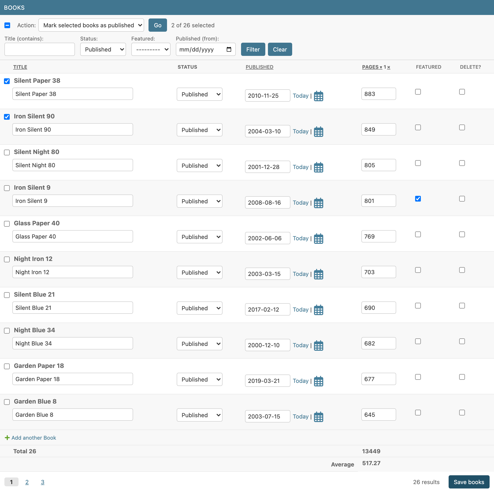
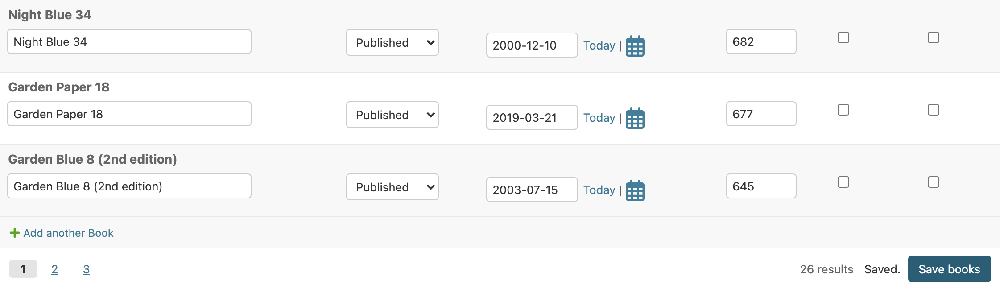
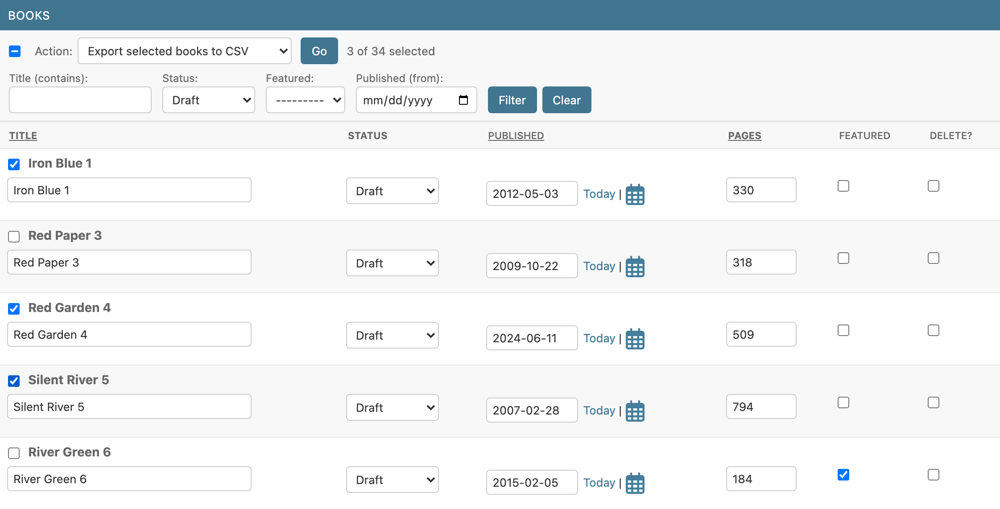
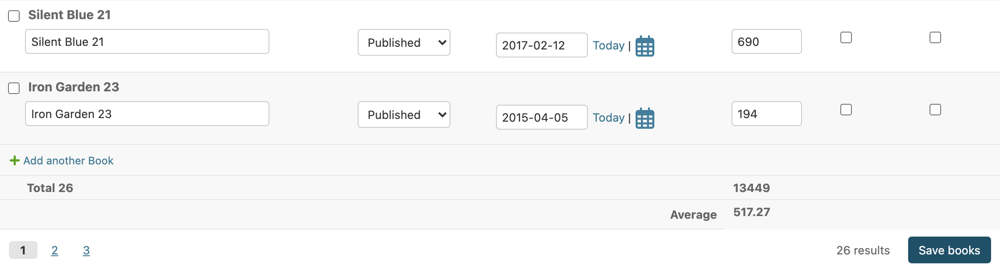

# django-admin-inline-controls

[](https://github.com/rodolvbg/django-admin-inline-controls/actions/workflows/pytest.yml)
[](https://pypi.org/project/django-admin-inline-controls/)
[](https://pypi.org/project/django-admin-inline-controls/)
[](https://pypi.org/project/django-admin-inline-controls/)
[](https://pepy.tech/project/django-admin-inline-controls)

Pagination, filtering and sortable columns for Django admin inlines —
without leaving the change form.



- **Pagination**: page links, or infinite scroll that appends rows as you
  reach the end of the inline.
- **Filters**: generated from lookups (`"status"`, `"title__icontains"`,
  `"published__gte"`), your own `forms.Form`, or a django-filter `FilterSet`.
- **Sortable columns**: click a tabular header (or the toolbar links on
  stacked inlines); multi-column, like the changelist.
- Filters, sorting and page links refresh **only that inline** in place.
  Several controlled inlines on the same page keep independent state.
- Rows loaded from several pages are saved together, and unsaved edits are
  never silently thrown away.
- Optional **"Save books" button** that saves only that inline, without
  submitting (or reloading) the rest of the page.
- **Actions** on the selected rows, like the changelist's: checkboxes,
  "select all", an action menu and a built-in `delete_selected`.
- **Footer rows** for totals, averages…: `Sum("pages")` below its column.
- Only depends on Django. No jQuery plugins, no htmx; works with
  `TabularInline` and `StackedInline`.

## Install

```bash
pip install django-admin-inline-controls
```

Add to `INSTALLED_APPS`:

```python
INSTALLED_APPS = [
    ...
    "django_admin_inline_controls",
]
```

## Usage

Mix `InlineControlsMixin` in before `TabularInline` or `StackedInline`:

```python
from django.contrib import admin
from django.db.models.functions import Lower

from django_admin_inline_controls.mixins import InlineControlsMixin


class BookInline(InlineControlsMixin, admin.TabularInline):
    model = Book
    extra = 0
    inline_per_page = 20
    inline_ordering_fields = {
        "title": Lower("title"),  # column name -> ordering expression
        "published": "published",
        "pages": "pages",
    }
    inline_filter_fields = ["title__icontains", "status", "featured", "published__gte"]


@admin.register(Author)
class AuthorAdmin(admin.ModelAdmin):
    inlines = [BookInline]
```

State lives in the URL, namespaced by the formset prefix
(`?books-page=2&books-o=-pages&books-f-status=published`), so links are
shareable and several inlines never clash.

### Options

| Attribute | Default | |
|---|---|---|
| `inline_per_page` | `None` | Rows per page. `None` disables pagination. |
| `inline_pagination` | `"pages"` | `"pages"` or `"infinite"` (load more on scroll). |
| `inline_ordering_fields` | `()` | Sortable columns: a list of field names, or `{column: expression}`. The expression can be a field path, an ORM expression (`Lower("title")`, `F("date").asc(nulls_last=True)`) or an explicit `(ascending, descending)` pair. |
| `inline_default_ordering` | `()` | Applied after the user's ordering. Defaults to the queryset's / model's ordering; `pk` is always appended so pages are stable. |
| `inline_filter_fields` | `()` | Filter lookups. A form is generated from them. |
| `inline_filter_form` | `None` | Your own filter `forms.Form`. |
| `inline_controls_ajax` | `True` | Refresh the inline in place instead of reloading the page. |
| `inline_save_button` | `False` | Show a button that saves only this inline. See [Saving only the inline](#saving-only-the-inline). |
| `inline_actions` | `()` | Actions for the selected rows. See [Inline actions](#inline-actions). |
| `inline_footer_rows` | `()` | Rows of totals, averages… below the table. See [Footer rows](#footer-rows). |
| `inline_footer_scope` | `"filtered"` | What the footer rows add up: `"filtered"` or `"page"`. |
| `inline_footer_tfoot` | `True` | Render the footer rows in the table's `<tfoot>` (tabular inlines); `False` shows them as a summary line. |
| `inline_footer_tfoot_template` | `django_admin_inline_controls/tfoot.html` | Template of that `<tfoot>`. |

Only columns declared in `inline_ordering_fields` can be sorted: ordering
by an arbitrary field from the URL would let anyone infer the values of
fields the inline never shows.

### Custom filters

Generated fields depend on the model field and lookup (choices → select,
`BooleanField` → Yes/No/any, dates → date input, relations →
`ModelChoiceField`, `__in` → multiple select, `__isnull` → Yes/No/any…).
Override `get_inline_filter_formfield(lookup)` to change one, or bring
your own form and handle the fields that aren't plain lookups:

```python
class BookFilterForm(forms.Form):
    q = forms.CharField(required=False, label="Search")
    status = forms.ChoiceField(
        required=False, choices=[("", "---"), *Book.Status.choices]
    )


class BookInline(InlineControlsMixin, admin.TabularInline):
    model = Book
    inline_per_page = 20
    inline_filter_form = BookFilterForm
    inline_filter_fields = ["status"]  # applied as lookups; "q" is handled below

    def filter_inline_queryset(self, request, queryset, filters):
        if search := filters.get("q"):
            queryset = queryset.filter(Q(title__icontains=search) | Q(isbn=search))
        return super().filter_inline_queryset(request, queryset, filters)
```

Every option also has a `get_*` hook taking `(request, obj)` —
`get_inline_per_page`, `get_inline_ordering_fields`,
`get_inline_filter_fields`, `get_inline_filter_form_class`,
`get_inline_filter_form_kwargs` (e.g. to pass the parent object to your
form) — and `get_inline_filtered_queryset()` is the single seam to plug in
any other filtering backend.

### Infinite scroll

```python
class ArticleInline(InlineControlsMixin, admin.TabularInline):
    model = Article
    inline_per_page = 30
    inline_pagination = "infinite"
```

The next page is appended when the "Load more" link scrolls into view (or
is clicked). Loaded rows join the formset, so everything visible is saved
with the object. Keep in mind Django's formset limits: by default a
formset accepts at most 1000 forms per submission (`max_num`).

### Saving only the inline

```python
from django_admin_inline_controls.mixins import (
    InlineControlsAdminMixin,
    InlineControlsMixin,
)


class BookInline(InlineControlsMixin, admin.TabularInline):
    model = Book
    inline_per_page = 20
    inline_save_button = True


@admin.register(Author)
class AuthorAdmin(InlineControlsAdminMixin, admin.ModelAdmin):
    inlines = [BookInline]
```

A **"Save books"** button (named after the inline's `verbose_name_plural`)
appears in the inline's footer, next to the pagination.



**How it works**

- Only that inline is sent: the JS posts its fields (files included), its
  management form and the CSRF token with `fetch`. Nothing from the parent
  form or from the other inlines.
- The server builds just that formset against the parent object **as
  stored in the database** (not the unsaved parent form), checks the
  permissions, validates it and calls your `save_formset()` inside a
  transaction. The change is recorded in the parent's history ("Changed
  Title for book X"), like a regular admin save; a save with no changes
  records nothing.
- The response is the re-rendered inline, swapped in place:
  - on errors, they are shown on their rows, as in a normal save, and the
    submitted values are kept so they can be fixed and saved again;
  - on success, a "Saved." status is shown and the inline no longer counts
    as having unsaved changes.
- Unsaved changes elsewhere on the page (the parent form, other inlines)
  are left untouched: still on screen, still unsaved.
- The current filters, ordering and page are kept. In infinite mode, as
  many pages as were loaded are shown again after saving.

**Requirements and caveats**

1. **The parent `ModelAdmin` needs `InlineControlsAdminMixin`.** An inline
   cannot register URLs of its own, so the endpoint lives on the parent
   admin (`<object_id>/inline-controls/<prefix>/save/`). A system check
   (`admin_inline_controls.E008`) reports a missing mixin; without it no
   button is shown.
2. **Permissions:** the user needs change permission on the parent object
   (as for any save from the change form) and add, change or delete
   permission on the inline's model. Within the formset, the inline's own
   permissions apply exactly as in the change form (view-only rows are
   not validated, rows can only be deleted with delete permission, …).
3. **`save_formset(request, form, formset, change)` gets an unchanged
   parent form**, built from the saved instance (`changed_data` is empty),
   because the real one was not submitted. If you override `save_formset()`
   and read `form.cleaned_data`, that won't work from this button.
   `save_model()` and `save_related()` are not called, so the parent's own
   fields (e.g. an `auto_now` "modified" date) are not updated.
4. **Changes to the parent form are not saved** by this button. It says so
   in its tooltip; use the admin's regular "Save" buttons to save
   everything.
5. Not available on nested_admin inlines (`admin_inline_controls.E102`).

### Inline actions

Like `ModelAdmin.actions`, for the rows of one inline:

```python
from django.contrib import admin, messages
from django_admin_inline_controls.actions import inline_action
from django_admin_inline_controls.mixins import (
    InlineControlsAdminMixin,
    InlineControlsMixin,
)


class BookInline(InlineControlsMixin, admin.TabularInline):
    model = Book
    inline_per_page = 20
    inline_actions = ["mark_published", "export_csv", "delete_selected"]

    @inline_action(
        permissions=["change"],
        description="Mark selected %(verbose_name_plural)s as published",
    )
    def mark_published(self, request, queryset):
        count = queryset.update(status=Book.Status.PUBLISHED)
        self.message_user(request, f"{count} books published.", messages.SUCCESS)

    @inline_action(description="Export selected %(verbose_name_plural)s to CSV")
    def export_csv(self, request, queryset):
        response = HttpResponse(content_type="text/csv")
        response["Content-Disposition"] = 'attachment; filename="books.csv"'
        ...
        return response


@admin.register(Author)
class AuthorAdmin(InlineControlsAdminMixin, admin.ModelAdmin):
    inlines = [BookInline]
```



**How it works**

- Every saved row gets a checkbox next to its name; the action bar at the
  top of the inline has a "select all rows on this page" checkbox, the
  action menu, **Go** and the "2 of 25 selected" count. When the whole
  page is selected and there are more rows, **"Select all 25"** extends the
  selection to every row matching the current filters, on every page.
- The checkboxes and the menu are not part of the change form: they are
  never submitted when the object is saved, and ticking them doesn't count
  as an unsaved change.
- **Go** posts only the action name and the selected primary keys. The
  action runs on a queryset that is always restricted to children of the
  object being edited (and to the current filters), so a tampered primary
  key can't reach other rows.
- If the inline has unsaved edits, you are asked first: the inline is
  re-rendered after the action, so they would be lost.

**Writing actions**

- Same signature as changelist actions: `action(inline, request,
  queryset)`. Entries of `inline_actions` can be method names, callables or
  `"delete_selected"`. The parent object is `request.inline_controls_parent`.
- `@inline_action` is `@admin.action` (`permissions`, `description`) plus
  `confirmation`: a prompt shown before running. `description` and
  `confirmation` may use `%(verbose_name)s` and `%(verbose_name_plural)s`;
  `confirmation` also `%(count)s`, the number of rows it will run on.
  Plain `@admin.action` functions work too.
- `permissions=["change"]` checks the inline's `has_change_permission()`
  (with the parent object); actions the user may not run are not offered,
  and are refused if posted anyway.
- Use `self.message_user()` as in a `ModelAdmin`: the messages are shown
  next to the action menu.
- Return `None` to re-render the inline (keeping the page, filters and
  ordering; in infinite mode, the loaded rows), a file response (it is
  downloaded and the page stays as is), or a redirect (followed). Any other
  response replaces the page.
- Actions don't record anything in the history by themselves, as in the
  changelist. The built-in **`delete_selected`** deletes the rows one by
  one (so `delete()` overrides and signals run), asks "Delete 3 selected
  books? This cannot be undone.", records the deletions in the parent's
  history and reports rows protected by `on_delete=PROTECT` instead of
  failing.

**Requirements:** like the save button, `InlineControlsAdminMixin` on the
parent `ModelAdmin` (`admin_inline_controls.E010`), and the user needs view
or change permission on the parent object. Not available on nested_admin
inlines (`admin_inline_controls.E103`).

### Footer rows

Totals, averages or any other summary below the inline's columns:

```python
from django.db.models import Avg, Count, Sum


class BookInline(InlineControlsMixin, admin.TabularInline):
    model = Book
    inline_per_page = 20
    inline_footer_rows = [
        ("Total", {"title": Count("pk"), "pages": Sum("pages")}),
        ("Average", {"pages": Avg("pages")}),
    ]
```



- Each row is a label and `{column: value}`. A value is an **aggregate**
  (`Sum`, `Avg`, `Count`, `Max`…, `filter=` included), a
  **`callable(queryset)`** for anything else, or a constant. All the
  aggregates of all the rows run in **one query**.
- **What is added up** — `inline_footer_scope`:
  - `"filtered"` (default): every row matching the current filters, on
    every page. With infinite scroll it doesn't depend on what is loaded.
  - `"page"`: the rows shown (not available with infinite scroll,
    `admin_inline_controls.E016`).
- Values come from the **database**. The rows follow filtering, sorting,
  paging, saving the inline and actions, since they arrive with the
  refreshed inline — with `inline_save_button`, saving the inline updates
  them without reloading the page.
- **Where they go — rendered by the server, no JS:** on tabular inlines,
  the rows are the table's own `<tfoot>`, each value under its column; the
  label spans the columns before the first value. The inline's template is
  rendered as usual (Django's, a theme's or your own) and the `<tfoot>` is
  inserted before its `</table>`, so there is no copy of Django's template
  to keep in sync. On stacked inlines, with `inline_footer_tfoot = False`,
  or when a value's column isn't a column of the table, they are a summary
  line in the footer ("Total: Pages 3250").

#### Changing how they look

- **The values' format**, in Python: by default the plain value, floats
  and decimals rounded to 2 decimals at most (`1234.5`). Override
  `format_inline_footer_value(column, value)` for currencies, units,
  localized numbers… (return safe HTML for markup):

  ```python
  from django.utils.formats import number_format

  def format_inline_footer_value(self, column, value):
      if column == "amount":
          return format_html("{} <small>USD</small>", number_format(value, 2))
      return super().format_inline_footer_value(column, value)
  ```

- **Which rows**, in Python: `get_inline_footer_rows(request, obj)` — e.g.
  one row per VAT rate from your own model method.
- **The markup**, in templates: the `<tfoot>` is
  `django_admin_inline_controls/tfoot.html` (blocks `tfoot`, `tfoot_row`,
  `tfoot_label`, `tfoot_cell`, `tfoot_value`), chosen per inline with
  `inline_footer_tfoot_template`; the summary line is in `footer.html`
  (blocks `footer_rows`, `footer_row`, `footer_cell`). Extend them and
  override only the block you need:

  ```django
  
  <strong>{{ slot.cell.value }}</strong>
  ```

#### Using the values from your own JS

Every value is in the HTML the server renders, with its raw number, for
your scripts to read — nothing to call:

| Attribute / selector | What it is |
|---|---|
| `[data-footer-key="<row index>:<column>"]` | A value's element (in the `<tfoot>` or the summary). |
| `data-footer-row`, `data-column` | Its row label and column. |
| `data-value` | Its number as plain digits (`"1234.5"`), `""` when it isn't a number; the element's text is the formatted value. |

```js
const total = document.querySelector(
    '#books-inline-controls [data-footer-row="Total"][data-column="pages"]',
);
Number(total.dataset.value); // 3250
```

When the inline is refreshed in place (filtering, paging, saving it,
actions) the footer comes back re-rendered, and `inline-controls:updated`
bubbles from the new content: read the values again there.

## Optional extras

The core only depends on Django. Integrations with third-party packages are
opt-in.

### django-filter

```bash
pip install django-admin-inline-controls[filters]
```

```python
from django_admin_inline_controls.contrib.filters import FilterSetInlineControlsMixin


class BookInline(FilterSetInlineControlsMixin, admin.TabularInline):
    model = Book
    inline_per_page = 20
    inline_filterset_class = BookFilterSet

    def get_inline_filterset_kwargs(self, request, obj):
        return {"parent": obj}  # extra kwargs for your FilterSet's __init__
```

The filterset gets the request too (`self.request`).

### django-nested-admin

```bash
pip install django-admin-inline-controls[nested]
```

```python
import nested_admin
from django_admin_inline_controls.contrib.nested import NestedInlineControlsMixin


class BookInline(NestedInlineControlsMixin, nested_admin.NestedTabularInline):
    model = Book
    inline_per_page = 20
```

nested_admin keeps its own client-side formset state, so with it filters,
sorting and page links reload the page instead of swapping the inline, and
infinite scroll, the save-inline button and inline actions are not
available.

## Customizing templates

Three templates render the controls around the inline's own `template`
(which is left untouched: `admin/edit_inline/tabular.html`, a custom one,
…). Each is chosen per inline, so a template of yours can extend the
library's and override only the blocks it needs:

| Option | Default | Renders |
|---|---|---|
| `inline_controls_template` | `django_admin_inline_controls/inline.html` | The wrapper: toolbar, the inline itself, footer. |
| `inline_controls_toolbar_template` | `django_admin_inline_controls/toolbar.html` | Actions, filters, sort links. |
| `inline_controls_footer_template` | `django_admin_inline_controls/footer.html` | Pagination / infinite scroll, save button. |

```python
class BookInline(InlineControlsMixin, admin.TabularInline):
    model = Book
    inline_controls_toolbar_template = "admin/demo/book_inline_toolbar.html"
```

```django
{# templates/admin/demo/book_inline_toolbar.html #}


Search


  <div class="my-filter">{{ block.super }}</div>



  <a href="">Help</a>

```

To change them for every inline, put templates with the same paths in your
project's `templates/` directory (before the app templates), or set the
options on a base inline class of your own.

In all three, `controls` is the inline's state (filter form, ordering
columns, page links, actions, URLs…) and `inline_admin_formset` is
Django's. The JS finds its elements by the `inline-controls-*` classes, the
`data-inline-controls-*` attributes and the container's id: keep them when
you replace a block's markup (`{{ block.super }}` keeps the original).

**`inline.html`**

| Block | Contains |
|---|---|
| `container` | The whole wrapper `<div>`. |
| `container_classes`, `container_attrs` | Extra classes / attributes for the wrapper (empty). |
| `before_toolbar`, `before_inline`, `after_inline`, `after_footer` | Empty slots between the parts. |
| `toolbar` | Includes `inline_controls_toolbar_template`. |
| `inline` | Includes the inline's own template. |
| `footer` | Includes `inline_controls_footer_template`. |
| `inline_without_controls` | What is rendered when the controls are off (the add view). |

**`toolbar.html`**

| Block | Contains |
|---|---|
| `toolbar` | The whole toolbar. |
| `toolbar_classes` | Extra classes (empty). |
| `toolbar_start`, `toolbar_end` | Empty slots at both ends. |
| `actions` | The action bar. |
| `action_menu`, `action_label`, `action_empty_option`, `action_option` | The "Action:" select and its options (`action_option` is rendered once per action, with `action`). |
| `action_button`, `action_button_label` | The **Go** button. |
| `action_selection` | The "2 of 25 selected" count and the "Select all" link. |
| `action_status` | Where action messages appear. |
| `filters` | The filter form. |
| `filter_fields`, `filter_field` | All fields / one field (once per field, with `field`). |
| `filter_buttons`, `filter_apply_button`, `filter_apply_label`, `filter_clear_button`, `filter_clear_label` | The **Filter** and **Clear** buttons. |
| `ordering`, `ordering_label`, `ordering_column` | The "Sort by:" links (once per column, with `column`). |

**`footer.html`**

| Block | Contains |
|---|---|
| `footer` | The whole footer. |
| `footer_classes` | Extra classes (empty). |
| `footer_start`, `footer_end` | Empty slots at both ends. |
| `footer_rows`, `footer_row`, `footer_cell` | The footer rows' summary line (`footer_row` once per row, with `row`; `footer_cell` once per value, with `cell`), when they aren't in the table's `<tfoot>`. |
| `pagination` | Page links or the infinite-scroll status. |
| `page_links`, `page_link` | The page links (`page_link` once per link, with `link`). |
| `result_count` | "25 results". |
| `infinite`, `infinite_count`, `load_more`, `load_more_label` | Infinite mode: "Showing 15 of 70" and "Load more". |
| `save`, `save_status`, `save_button`, `save_label` | The save-inline button and its status. |

**`inline_response.html`** (the save/action endpoints' response):
`response`, `inlines`. Set `inline_controls_response_template` on the
`ModelAdmin` to use another one.

## Adapting to another admin markup

The templates decide the HTML of the controls, but the JS also has to find
its way in the **inline's** markup — Django's `tabular.html` /
`stacked.html`, or whatever your theme (Unfold, Jazzmin, Grappelli…) or
your own inline template renders. Where to look is configurable per inline
with `inline_controls_selectors`, merged over these defaults
(`DEFAULT_SELECTORS` in `django_admin_inline_controls.controls`):

| Key | Default | Used for |
|---|---|---|
| `container` | `.inline-group fieldset` | Where the toolbar and footer are moved to. |
| `heading` | `h2` | Inside `container`: the toolbar goes right after it (or its `<summary>`). |
| `footer_parent` | `:scope > details` | Inside `container`: the footer is appended here, else to `container`. |
| `table_head` | `.inline-group table thead` | The header row with the sortable columns. |
| `column_header` | `th.column-{name}` | A sortable column's header (`{name}`: the column). |
| `row_label` | `:scope > td.original > p`, `:scope > h3`, `:scope > td.original` | Inside a saved row: where its action checkbox goes. |
| `tabular_rows` | `{group} .tabular.inline-related tbody:first > tr.form-row` | jQuery selector of the rows Django's `inlines.js` manages, re-initialized after a refresh (`{group}`: `#<prefix>-group`). |
| `stacked_rows` | `{group} .inline-related` | The same for stacked inlines. |

Each value is one selector or a list tried in order. Only set the keys that
differ:

```python
class BookInline(InlineControlsMixin, admin.TabularInline):
    model = Book
    template = "admin/my_theme/tabular.html"
    inline_ordering_fields = ["title", "pages"]
    inline_controls_selectors = {
        "container": ".card",
        "heading": ".card-title",
        "table_head": "table.grid thead",
        "column_header": 'th[data-col="{name}"]',
        "row_label": ":scope > td.row-name > .label",
        "tabular_rows": "{group} table.grid tbody > tr.form-row",
    }
```

For a whole theme, set it on a base inline class of your own. When
something isn't found, the controls degrade instead of breaking: sort links
stay in the toolbar if a column header is missing, checkboxes go into the
row itself, and the toolbar and footer stay around the inline. Row ids
(`<prefix>-<n>`) and the management form come from Django's formset, so
they are never configured.

To place the toolbar and footer yourself, listen for
`inline-controls:place` (it bubbles from the controls' wrapper,
`.inline-controls`, before they are moved) and cancel it:

```js
document.addEventListener("inline-controls:place", (event) => {
    const { toolbar, footer } = event.detail;
    event.target.querySelector(".my-panel-header").append(toolbar);
    event.target.querySelector(".my-panel-footer").append(footer);
    event.preventDefault();
});
```

## System checks

Misconfigurations are reported by `manage.py check` (and at startup):

| ID | Problem |
|---|---|
| `admin_inline_controls.E001` | `inline_pagination` is not `"pages"` or `"infinite"`. |
| `admin_inline_controls.E002` | `inline_per_page` is not a positive integer or `None`. |
| `admin_inline_controls.E003` | `inline_pagination = "infinite"` without `inline_per_page`. |
| `admin_inline_controls.E004` | `inline_filter_fields` is a string instead of a list or tuple. |
| `admin_inline_controls.E005` | `inline_filter_fields` refers to a field the model doesn't have. |
| `admin_inline_controls.E006` | `inline_ordering_fields` is not a list, tuple or dict. |
| `admin_inline_controls.E007` | An `inline_ordering_fields` column starts with `-` or contains a comma. |
| `admin_inline_controls.E008` | `inline_save_button = True` but the parent `ModelAdmin` lacks `InlineControlsAdminMixin`. |
| `admin_inline_controls.E009` | An `inline_actions` entry is not a method of the inline, a callable or a built-in action. |
| `admin_inline_controls.E010` | `inline_actions` is set but the parent `ModelAdmin` lacks `InlineControlsAdminMixin`. |
| `admin_inline_controls.E011` | `inline_controls_selectors` is not a dict. |
| `admin_inline_controls.E012` | An `inline_controls_selectors` key is unknown, or its value is not a selector or a non-empty list of selectors. |
| `admin_inline_controls.E013` | `inline_footer_rows` is not a list of `(label, {column: value})` pairs. |
| `admin_inline_controls.E014` | An `inline_footer_rows` column is not a field of the model or of the inline. |
| `admin_inline_controls.E015` | `inline_footer_scope` is not `"filtered"` or `"page"`. |
| `admin_inline_controls.E016` | `inline_footer_scope = "page"` with infinite scroll. |
| `admin_inline_controls.E017` | `inline_footer_tfoot` is not `True` or `False`. |
| `admin_inline_controls.E101` | `inline_pagination = "infinite"` on a nested_admin inline. |
| `admin_inline_controls.E102` | `inline_save_button = True` on a nested_admin inline. |
| `admin_inline_controls.E103` | `inline_actions` on a nested_admin inline. |

## JavaScript files

Each inline loads only the scripts it uses, through its `media`: `core.js`
(pagination, filters, sorting, placing the controls) always, `save.js`
with `inline_save_button` and `actions.js` with `inline_actions`. The admin
merges the media of every inline on the page, so each file loads at most
once.

## JavaScript events

After an inline is refreshed in place, or rows are appended, an
`inline-controls:updated` event bubbles from the new content: hook your own
widget initialization there (or read the footer values again, see
[Using the values from your own JS](#using-the-values-from-your-own-js)).
Before the toolbar and footer are placed, a
cancelable `inline-controls:place` event bubbles from the controls'
wrapper (see [Adapting to another admin markup](#adapting-to-another-admin-markup)). The admin's own inline machinery, autocomplete,
date/time shortcuts and `filter_horizontal` widgets are re-initialized
automatically.

## Demo

```bash
cd example
python manage.py migrate
python manage.py seed_demo      # admin/admin + an author with many books
python manage.py runserver
```

## Translations

Ships a Spanish (`es`) translation; every text of the controls — the
toolbar, the footer, the generated filter labels ("Title (contains)"), the
action messages and the JS prompts, which the server sends already
translated — follows the admin's active language.

Messages identical to Django admin's own ("Filter", "Delete selected
%(verbose_name_plural)s", …) use the admin's translation, since
`django.contrib.admin` comes first in `INSTALLED_APPS`: the inline then
reads exactly like the changelist.

## Compatibility

Django 4.2 – 6.1, Python 3.10+.

## License

MIT
