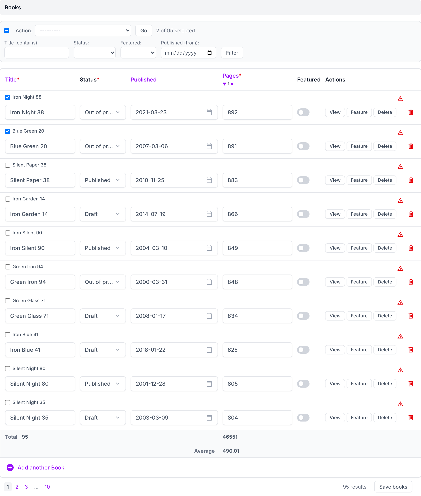
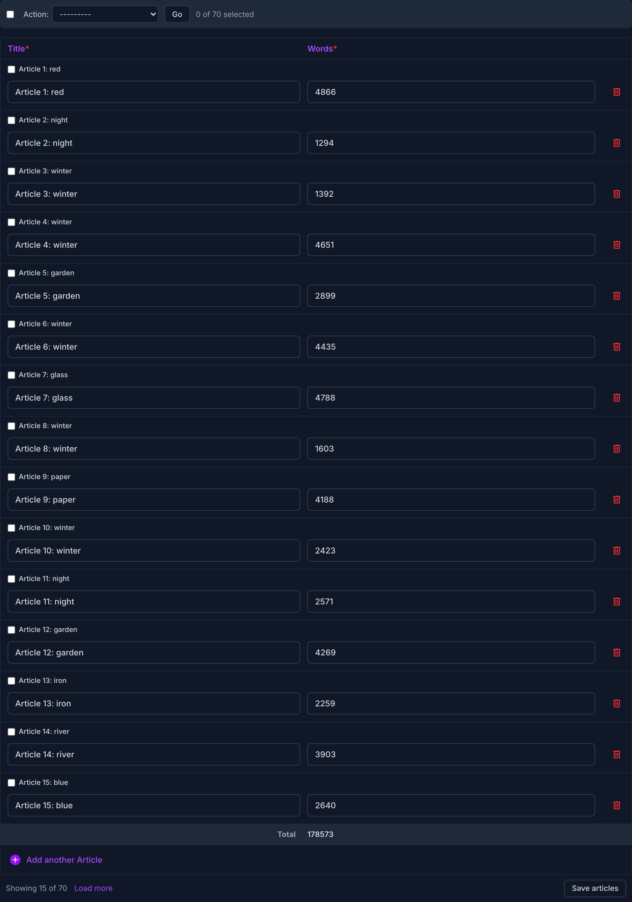
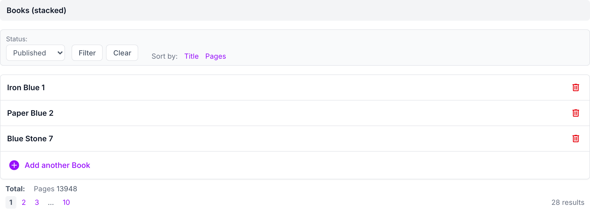

# django-admin-inline-controls with django-unfold

## Usage

```bash
pip install django-admin-inline-controls[unfold]
```

```python
from unfold.admin import ModelAdmin, TabularInline
from django_admin_inline_controls.contrib.unfold import UnfoldInlineControlsMixin
from django_admin_inline_controls.mixins import InlineControlsAdminMixin


class BookInline(UnfoldInlineControlsMixin, TabularInline):
    model = Book
    inline_per_page = 20


@admin.register(Author)
class AuthorAdmin(InlineControlsAdminMixin, ModelAdmin):
    inlines = [BookInline]
```

Everything works as with Django's admin, tabular and stacked, in light and
dark mode:
- the controls are placed with Unfold's markup (`UNFOLD_SELECTORS`, under
  the inline's own `inline_controls_selectors`) and use its colors;
- the footer rows go in the table under Unfold's "Add another";
- Unfold's "Add another" and delete buttons keep working after the inline
  is refreshed (`js/contrib/unfold.js`).
- row actions (`inline_actions`) are styled like Unfold's buttons.

Paginate with `inline_per_page`: Unfold's own `per_page` would paginate the
inline a second time (`admin_inline_controls.E104`). Unfold's `tab` and
`collapsible` options work as usual; for a collapsible inline use its
`collapsible`, not Django's `classes = ["collapse"]`.

## Screenshots

A tabular inline, sorted by a column, with rows selected, the row actions
(View, Feature, Delete) and the footer rows:



An inline in one of Unfold's tabs, in dark mode, with infinite scroll:



A stacked inline with Unfold's collapsible rows, filtered:



## Demo

```bash
cd example
DJANGO_SETTINGS_MODULE=example.settings_unfold python manage.py runserver
```

## Compatibility

django-unfold 0.108+ (Django 5.2+, Python 3.12+).
